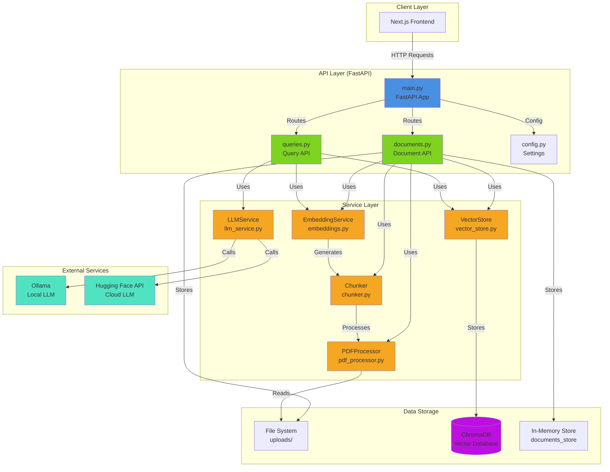
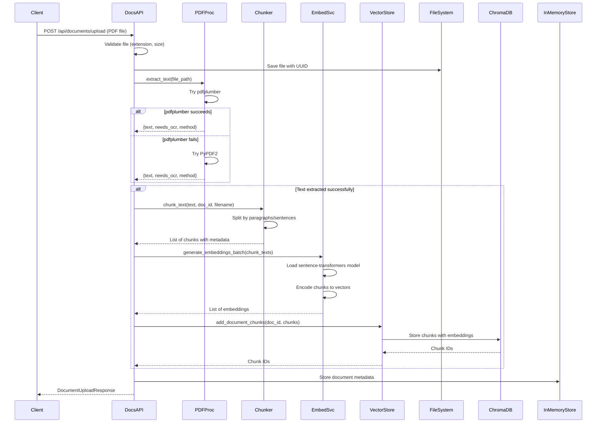
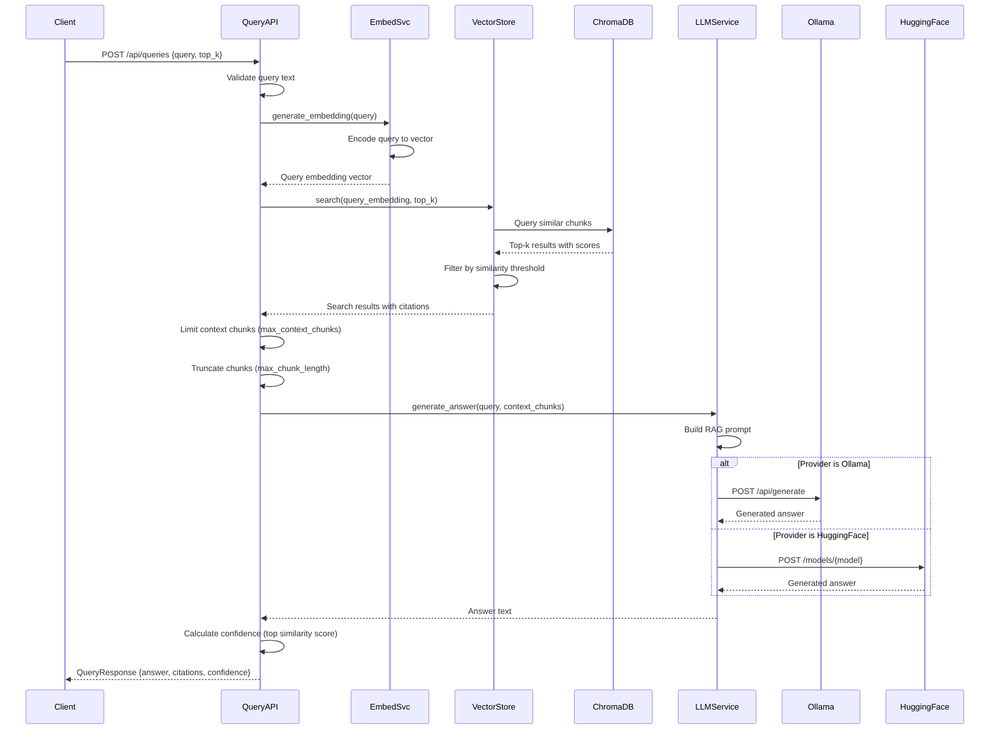
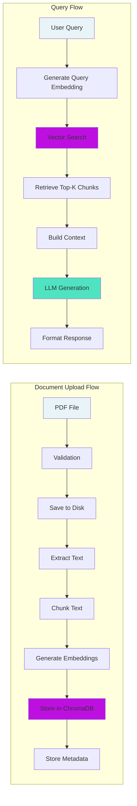
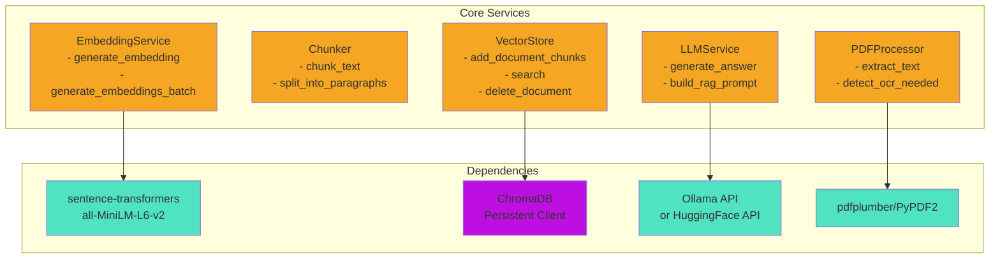
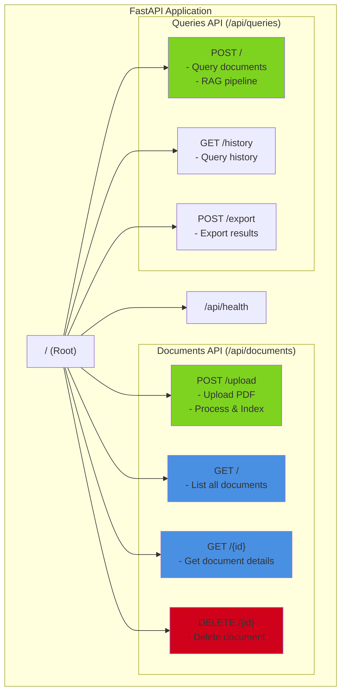

# Backend Architecture Documentation

This document provides a comprehensive overview of the LexMedica backend architecture, including all services, APIs, and data flows.

## Table of Contents

1. [System Architecture Overview](#system-architecture-overview)
2. [Document Upload Workflow](#document-upload-workflow)
3. [Query Workflow (RAG Pipeline)](#query-workflow-rag-pipeline)
4. [Component Interaction Diagram](#component-interaction-diagram)
5. [Service Dependencies](#service-dependencies)
6. [API Endpoints Overview](#api-endpoints-overview)
7. [Data Flow Summary](#data-flow-summary)

---

## System Architecture Overview



---

## Document Upload Workflow



### Upload Flow Steps

1. **File Validation**: Check file extension (.pdf), size (max 10MB), and non-empty
2. **File Storage**: Save PDF to `uploads/` directory with UUID filename
3. **Text Extraction**: Use PDFProcessor (pdfplumber → PyPDF2 fallback)
4. **Chunking**: Split text into semantic chunks (500 chars, 50 overlap)
5. **Embedding Generation**: Generate vector embeddings for each chunk
6. **Vector Storage**: Store chunks with embeddings in ChromaDB
7. **Metadata Storage**: Store document metadata in in-memory store
8. **Response**: Return document ID and processing statistics

---

## Query Workflow (RAG Pipeline)



### Query Flow Steps

1. **Query Validation**: Ensure query text is not empty
2. **Query Embedding**: Generate vector embedding for the query
3. **Vector Search**: Search ChromaDB for similar chunks (top-k)
4. **Similarity Filtering**: Filter results by similarity threshold (default: 0.3)
5. **Context Preparation**: Limit and truncate chunks for LLM (max 3 chunks, 300 chars each)
6. **LLM Generation**: Build RAG prompt and generate answer using Ollama/HuggingFace
7. **Response Formatting**: Calculate confidence score and format response with citations

---

## Component Interaction Diagram



---

## Service Dependencies



### Service Details

#### PDFProcessor (`pdf_processor.py`)
- **Purpose**: Extract text from PDF files
- **Methods**: 
  - `extract_text(file_path)` - Main extraction method
  - `_extract_with_pdfplumber()` - Primary extraction method
  - `_extract_with_pypdf2()` - Fallback extraction method
  - `_detect_ocr_needed()` - Detect scanned PDFs
- **Dependencies**: pdfplumber, PyPDF2

#### Chunker (`chunker.py`)
- **Purpose**: Split documents into semantic chunks
- **Methods**:
  - `chunk_text(text, document_id, filename)` - Main chunking method
  - `_split_into_paragraphs()` - Split by paragraphs
  - `_split_large_paragraph()` - Split large paragraphs by sentences
  - `_split_by_words()` - Last resort word-based splitting
- **Configuration**: chunk_size (500), chunk_overlap (50)

#### EmbeddingService (`embeddings.py`)
- **Purpose**: Generate vector embeddings for text
- **Methods**:
  - `generate_embedding(text)` - Single text embedding
  - `generate_embeddings_batch(texts)` - Batch embeddings
  - `get_embedding_dimension()` - Get embedding dimension
- **Model**: all-MiniLM-L6-v2 (384 dimensions)
- **Dependencies**: sentence-transformers

#### VectorStore (`vector_store.py`)
- **Purpose**: Manage document chunks in ChromaDB
- **Methods**:
  - `add_document_chunks(document_id, chunks)` - Store chunks
  - `search(query_embedding, top_k)` - Search similar chunks
  - `delete_document(document_id)` - Delete document chunks
  - `get_document_chunks(document_id)` - Retrieve chunks
- **Dependencies**: ChromaDB

#### LLMService (`llm_service.py`)
- **Purpose**: Generate answers using LLM with RAG context
- **Methods**:
  - `generate_answer(query, context_chunks)` - Main generation method
  - `_build_rag_prompt()` - Build prompt with context
  - `_generate_with_ollama()` - Ollama generation
  - `_generate_with_huggingface()` - HuggingFace generation
- **Providers**: Ollama (local) or HuggingFace (cloud)
- **Dependencies**: requests, ollama API

---

## API Endpoints Overview



### Endpoint Details

#### Root Endpoints
- `GET /` - Root endpoint, returns API info
- `GET /api/health` - Health check endpoint

#### Documents API (`/api/documents`)
- `POST /upload` - Upload and process PDF document
  - **Request**: Multipart file upload
  - **Response**: DocumentUploadResponse with document_id, stats
- `GET /` - List all uploaded documents
  - **Response**: DocumentListResponse with document metadata
- `GET /{id}` - Get document details (including chunks)
  - **Response**: Document with full details
- `DELETE /{id}` - Delete document and all its chunks
  - **Response**: Success message

#### Queries API (`/api/queries`)
- `POST /` - Query documents using RAG pipeline
  - **Request**: QueryRequest {query, top_k}
  - **Response**: QueryResponse {answer, citations, confidence}
- `GET /history` - Get query history
  - **Response**: List of QueryHistoryEntry
- `POST /export` - Export query results
  - **Request**: Export format (markdown/json)
  - **Response**: Exported data

---

## Data Flow Summary

```
┌─────────────────────────────────────────────────────────────────┐
│                    BACKEND ARCHITECTURE                         │
└─────────────────────────────────────────────────────────────────┘

INPUT: PDF Document
  │
  ├─► [API Layer] documents.py
  │     │
  │     ├─► [Service] PDFProcessor
  │     │     └─► Extract text (pdfplumber → PyPDF2 fallback)
  │     │
  │     ├─► [Service] Chunker
  │     │     └─► Split into semantic chunks (500 chars, 50 overlap)
  │     │
  │     ├─► [Service] EmbeddingService
  │     │     └─► Generate vectors (sentence-transformers)
  │     │
  │     └─► [Service] VectorStore
  │           └─► Store in ChromaDB with metadata
  │
  └─► OUTPUT: Document indexed in vector database

──────────────────────────────────────────────────────────────────

INPUT: User Query
  │
  ├─► [API Layer] queries.py
  │     │
  │     ├─► [Service] EmbeddingService
  │     │     └─► Generate query embedding
  │     │
  │     ├─► [Service] VectorStore
  │     │     └─► Search similar chunks (top-k, threshold)
  │     │
  │     └─► [Service] LLMService
  │           ├─► Build RAG prompt with context
  │           └─► Generate answer (Ollama/HuggingFace)
  │
  └─► OUTPUT: Answer + Citations + Confidence Score
```

---

## Configuration

All configuration is managed through `app/config.py` using Pydantic Settings:

- **API**: Title, version, debug mode, CORS origins
- **Vector DB**: ChromaDB path, collection name
- **Embeddings**: Model name (all-MiniLM-L6-v2), dimension (384)
- **LLM**: Provider (ollama/huggingface), model, API URLs/keys
- **Retrieval**: Top-k (5), similarity threshold (0.3)
- **Chunking**: Chunk size (500), overlap (50)
- **File Upload**: Max size (10MB), allowed extensions, upload directory
- **LLM Context**: Max context chunks (3), max chunk length (300)

---

## Key Design Decisions

1. **Lazy Service Initialization**: Services are initialized on-demand to avoid startup failures
2. **Singleton Pattern**: Services are reused across requests for efficiency
3. **In-Memory Document Store**: Currently uses dictionary (will be replaced with database in production)
4. **ChromaDB**: Embedded vector database for simplicity and portability
5. **Modular Services**: Each service is independent and testable
6. **Error Handling**: Comprehensive error handling with helpful messages
7. **Memory Optimization**: Limits context chunks and truncates text for LLM to reduce memory usage

---

## Technology Stack

- **Framework**: FastAPI (Python 3.11+)
- **Vector Database**: ChromaDB (embedded, persistent)
- **Embeddings**: sentence-transformers (all-MiniLM-L6-v2)
- **PDF Processing**: pdfplumber, PyPDF2
- **LLM**: Ollama (local) or HuggingFace API (cloud)
- **Validation**: Pydantic models
- **Configuration**: Pydantic Settings with .env support

---

## Future Enhancements

- Database integration for persistent document storage
- OCR support for scanned PDFs
- Multi-collection support for document organization
- Authentication and authorization
- Rate limiting and request throttling
- Advanced retrieval strategies (reranking, hybrid search)
- Caching for frequently accessed documents
- Streaming responses for large queries
- Batch document processing
- Document versioning
